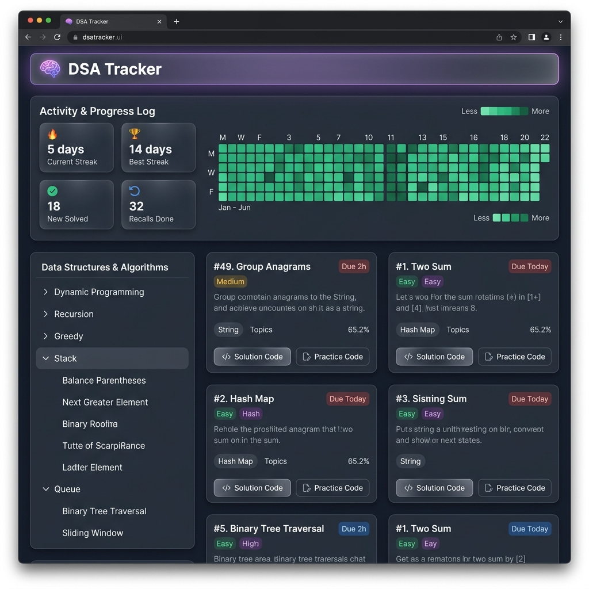
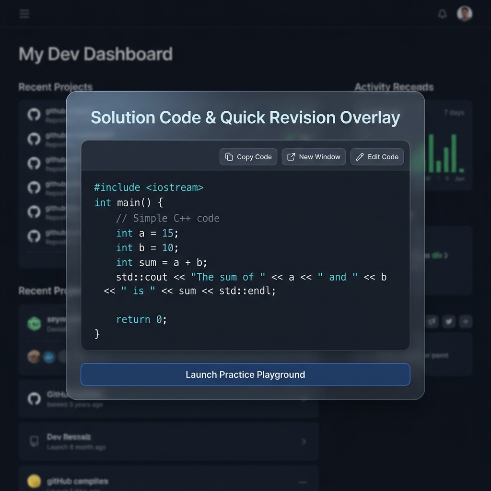
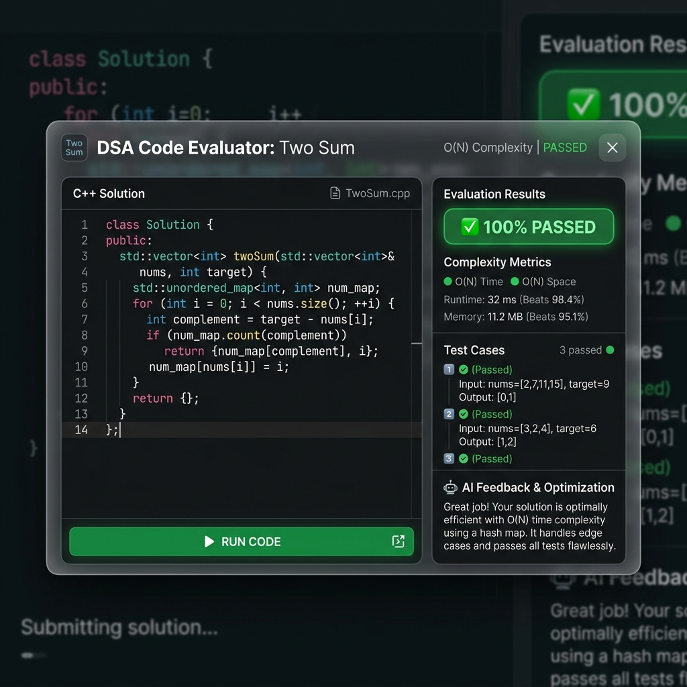

# 🧠 DSA Tracker & AI-Powered Spaced Repetition Platform

DSA Tracker is a full-stack, enterprise-grade web application engineered to help developers master Data Structures and Algorithms (DSA) through intelligent spaced repetition (SuperMemo-2 SM-2 algorithm), active recall, solution code persistence, and AI-driven static code evaluation.

Rather than relying on passive flashcards or subjective self-reporting, DSA Tracker forces **Active Recall** by requiring users to articulate their algorithmic logic in natural language and write executable code in an interactive playground. An AI "Study Buddy" evaluates the logic, simulates test-case execution, grades performance, and dynamically computes revision schedules.

---

## 🌟 Visual Showcase & Key Features

### 📊 1. Activity & Progress Heatmap Dashboard
* **GitHub-Style Contribution Grid**: Visualizes daily problem logs and recall sessions across a 22-week timeline.
* **Consistency Analytics**: Live badges tracking *Current Streak*, *Longest Streak*, *New Solved Questions*, and *Total Recalls Completed*.
* **Flicker-Free Tooltips**: Fixed-layout hover tooltips providing instant daily breakdown without page layout shifts.



---

### 🗂️ 2. Hierarchical Pattern Taxonomy Sidebar
* **Two-Tiered Classification**: Strictly separates primary Data Structure topics (*Stack*, *Queue*, *Array & Two Pointers*, *Trees & Graphs*) from expandable pattern subtopics (*Monotonic Stack*, *Sliding Window*, *Index/Width Calculation*).
* **User-Approach Integrity**: Classifies problems based on the algorithm *you actually implemented* rather than generic tags.
* **Instant Filter & Search**: Click any topic or subtopic to instantly search across all logged questions.

---

### 📝 3. User-First AI Solution Notes & Dual-View Engine
* **Pedagogical Enhancement**: Converts raw notes into structured Markdown guides (💡 Core Intuition, 🛠️ Algorithm Steps, ⚠️ Edge Cases).
* **Dual-View Toggle**: Switch between **Your Raw Thoughts** and **AI Structured Guide** with a single click.

---

### 💻 4. Solution Code Storage & Standalone Revision Window
* **Multi-Language Persistence**: Store solution code in C++, Python, Java, JavaScript, or Go directly in MongoDB alongside custom test cases.
* **Syntax-Highlighted Revision Overlay**: Inspect stored solutions in a glassmorphic viewer.
* **One-Click Actions**: Includes **Copy Code** and **New Window** popout button to open standalone revision windows for multi-monitor study setups.
* **IDE Keyboard Engine**: Custom keyboard handler supporting `Tab` / `Shift+Tab` 4-space indentation, smart `Enter` auto-indentation, bracket auto-closing `() {} [] "" ''`, and smart pair backspacing.



---

### ⚡ 5. Interactive Practice Playground & AI Compiler / Grader
* **AI LeetCode Boilerplate Synthesizer**: Automatically generates exact method signatures and class definitions matching LeetCode based on the problem title and URL.
* **Simulated Execution & Test Case Matrix**: Runs your code against custom test cases and produces an execution matrix comparing *Input*, *Expected Output*, and *Actual Output*.
* **Big-O Complexity Engine**: Calculates Big-O Time Complexity (e.g. $O(N)$) and Auxiliary Space Complexity (e.g. $O(1)$).
* **Line-by-Line Debugging Feedback**: Provides a comprehensive score (0–100%) alongside debugging hints, edge case highlights, and optimization tips.



---

## 🛠️ Architecture & Tech Stack

* **Frontend**: React (Vite), Tailwind CSS (Glassmorphism design, vibrant dark mode, Lucide icons)
* **Backend**: Node.js, Express.js (RESTful API architecture)
* **Database**: MongoDB (Mongoose Schema with extended code & test-case schemas)
* **AI & LLM Orchestration**: LangChain.js via OpenRouter API utilizing `nvidia/nemotron-3.5-lightning`
* **Agentic Graph Context**: NanoNets Graft (`@nanonets/graft`) for deterministic codebase context indexing
* **Containerization**: Docker & Docker Compose

---

## 🚀 Getting Started & Installation

### Prerequisites
* Node.js v18+ (Required)
* An [OpenRouter API Key](https://openrouter.ai/) (Required for AI grading & classification features)
* [Docker](https://www.docker.com/get-started) (Optional, for containerized deployment)

---

### Installation Steps

1. **Clone the repository:**
   ```bash
   git clone https://github.com/Allen20306/DSA_Tracker.git
   cd DSA_Tracker
   ```

2. **Configure Environment Variables:**
   Copy the example environment file in the `server/` directory:
   ```bash
   cp server/.env.example server/.env
   ```
   Open `server/.env` and paste your OpenRouter API Key. If you are NOT using Docker, you will also need to update the `MONGODB_URI` (see below).

---

### Option A: Local Development (Without Docker) - 🚀 Recommended for Contributing
If you want to contribute to the code without installing Docker, you can run the entire stack with a single command!

1. **Set up a Free Cloud Database (MongoDB Atlas)**:
   * Go to [MongoDB Atlas](https://www.mongodb.com/cloud/atlas/register) and create a free cluster.
   * Click "Connect" -> "Connect your application" and copy the connection string.
   * Paste it into your `server/.env` file: `MONGODB_URI=mongodb+srv://<username>:<password>@cluster0.mongodb.net/dsa_tracker`

2. **Install all dependencies:**
   From the root of the project, run:
   ```bash
   npm run install:all
   ```

3. **Run the App (One Command!):**
   ```bash
   npm run dev
   ```
   This uses `concurrently` to boot up both the Vite frontend (`http://localhost:5173`) and the Express backend (`http://localhost:5000`) in the same terminal window!

---

### Option B: Run with Docker Compose
If you just want to run the app without setting up MongoDB Atlas, Docker will spin up a local MongoDB container automatically.

1. Keep `MONGODB_URI=mongodb://mongo:27017/dsa_tracker` in your `server/.env` file.
2. Spin up the containers:
   ```bash
   docker-compose up --build
   ```
3. The app is now live at `http://localhost:5173`.

---

## 🌳 Graft Codebase Context Graph

This project is indexed with **Graft** (`@nanonets/graft`). It creates small linked markdown nodes representing every file, symbol, and API surface in `graft/`, providing coding AI agents with zero-exploration context.

### Installing Graft
To install Graft globally so you can query the knowledge graph:
```bash
npm install -g @nanonets/graft
```

### Using Graft
* **Orient yourself**: Run `graft map` to get a token-budgeted orientation of the directory clusters.
* **Ask a question**: Run `graft ask "How does the SM-2 algorithm schedule questions?" --source`
* **Rebuild the graph**: If you add new files or make major structural changes, rebuild the graph:
  ```bash
  npx @nanonets/graft build
  ```

---

## 📄 License

Distributed under the MIT License. See `LICENSE` for more information.
